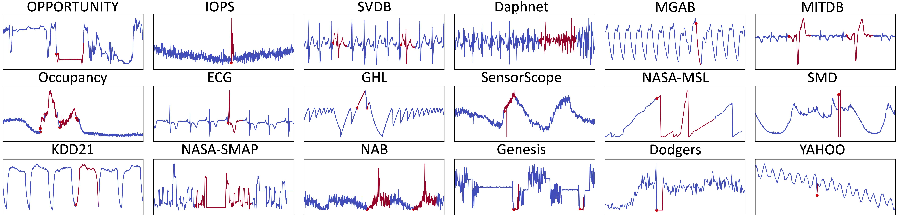

# TSB-UAD: An End-to-End Anomaly Detection Benchmark Suite for Univariate Time-Series Data

TSB-UAD is a new open, end-to-end benchmark suite to ease the
evaluation of univariate time-series anomaly detection methods. Overall, TSB-UAD
contains 12686 time series with labeled anomalies spanning
different domains with high variability of anomaly types, ratios,
and sizes. Specifically, TSB-UAD includes 18 previously proposed
datasets containing 1980 time series from real-world data science applications. 
Motivated by flaws in certain datasets and evaluation strategies in the literature,
we study anomaly types and data transformations to contribute
two collections of datasets. Specifically, we generate 958 time series
using a principled methodology for transforming 126 time-series
classification datasets into time series with labeled anomalies. In
addition, we present a set of data transformations with which we
introduce new anomalies in the public datasets, resulting in 10828
time series (92 datasets) with varying difficulty for anomaly detection.

## Publication

If you use TSB-UAD in your project or research, please cite our paper:

John Paparrizos, Yuhao Kang, Paul Boniol, Ruey S. Tsay, Themis Palpanas,
and Michael J. Franklin. TSB-UAD: An End-to-End Benchmark Suite for
Univariate Time-Series Anomaly Detection. PVLDB, 15(8): 1697 - 1711, 2022.
doi:10.14778/3529337.3529354


## Datasets

Due to limitations in the upload size on GitHub, we host the datasets at a different location:

Public: http://chaos.cs.uchicago.edu/tsb-uad/public.zip

Synthetic: http://chaos.cs.uchicago.edu/tsb-uad/synthetic.zip

Artificial: http://chaos.cs.uchicago.edu/tsb-uad/artificial.zip

The UCR classification datasets used to generate the Artificial datasets: http://chaos.cs.uchicago.edu/tsb-uad/UCR2018-NEW.zip

## Contributors

* John Paparrizos (University of Chicago)
* Yuhao Kang (University of Chicago)
* Alex Wu (University of Chicago)
* Teja Bogireddy (University of Chicago)
* Paul Boniol (Université Paris Cité)

## Installation

The following tools are required to install TSB-UAD from source:

- git
- conda (anaconda or miniconda)

#### Steps

1. Clone this repository using git and change into its root directory.

```bash
git clone https://github.com/johnpaparrizos/TSB-UAD.git
cd TSB-UAD/
```

2. Create and activate a conda-environment 'TSB'.

```bash
conda env create --file environment.yml
conda activate TSB
```

3. Install TSB-UAD using setup.py:

```
python setup.py install
```
   
4. Install the dependencies from `requirements.txt`:
```
pip install -r requirements.txt
```


## Usage
* test_anomaly_detectors.ipynb : The performance of 11 popular anomaly detectors. 
* test_artificialConstruction.ipynb: The synthesized dataset based on anomaly construction. 
* test_transformer.ipynb: The effects of 11 transformations.

## Benchmark 

All are datasets and time series are stored in ./data. We describe below the diferenrt types of datasets used in our benchmark.

### Benchmark: Public Real Datasets 

We first collected 18 public datasets from heterogeneous domains (you may find them in benchmark/).
The figure below shows some typical outliers in these 18 datasets.



Briefly, TSB-UAD includes the following datasets:
* **Dodgers**: is a loop sensor data for the Glendale on-ramp for the 101 North freeway in Los Angeles and the anomalies represent unusual traffic after a Dodgers game.
* **ECG**: is a standard electrocardiogram dataset and the anomalies represent ventricular premature contractions. We split one long series (MBA_ECG14046) with length ∼ 1e7) to 47 series by first identifying the periodicity of the signal.
* **IOPS**: is a dataset with performance indicators that reflect the scale, quality of web services, and health status of a machine.
* **KDD21**: is a composite dataset released in a recent SIGKDD 2021 competition with 250 time series.
* **MGAB**: is composed of Mackey-Glass time series with non-trivial anomalies. Mackey-Glass time series exhibit chaotic behavior that is difficult for the human eye to distinguish.
* **NAB**: is composed of labeled real-world and artificial time series including AWS server metrics, online advertisement clicking rates, real time traffic data, and a collection of Twitter mentions of large publicly-traded companies.
* **NASA-SMAP and NASA-MSL**: are two real spacecraft telemetry data with anomalies from Soil Moisture Active Passive (SMAP) satellite and Curiosity Rover on Mars (MSL). We only keep the first data dimension that presents the continuous data, and we omit the remaining dimensions with binary data.
* **SensorScope**: is a collection of environmental data, such as temperature, humidity, and solar radiation, collected from a typical tiered sensor measurement system.
* **Yahoo**: is a dataset published by Yahoo labs consisting of real and synthetic time series based on the real production traffic to some of the Yahoo production systems.
* **Daphnet**: contains the annotated readings of 3 acceleration sensors at the hip and leg of Parkinson’s disease patients that experience freezing of gait (FoG) during walking tasks.
* **GHL**: is a Gasoil Heating Loop Dataset and contains the status of 3 reservoirs such as the temperature and level. Anomalies indicate changes in max temperature or pump frequency.
* **Genesis**: is a portable pick-and-place demonstrator which uses an air tank to supply all the gripping and storage units.
* **MITDB**: contains 48 half-hour excerpts of two-channel ambulatory ECG recordings, obtained from 47 subjects studied by the BIH Arrhythmia Laboratory between 1975 and 1979.
* **OPPORTUNITY (OPP)**: is a dataset devised to benchmark human activity recognition algorithms (e.g., classiffication, automatic data segmentation, sensor fusion, and feature extraction). The dataset comprises the readings of motion sensors recorded while users executed typical daily activities.
* **Occupancy**: contains experimental data used for binary classiffication (room occupancy) from temperature, humidity, light, and CO2. Ground-truth occupancy was obtained from time stamped pictures that were taken every minute.
* **SMD (Server Machine Dataset)**: is a 5-week-long dataset collected from a large Internet company. This dataset contains 3 groups of entities from 28 different machines.
* **SVDB**: includes 78 half-hour ECG recordings chosen to supplement the examples of supraven

The following table summarizes different characteristics of the datasets.


| Dataset    | Count |	Average length |	Average number of anomalies |	Average number of abnormal points |
|:--|:---------:|:-------:|:--------:|:-------:|
|Dodger     | 1     |	50400.0        |	133.0                       |	5612                              |
|ECG        | 52    |	230351.9       |	195.6                       |	15634                             |
|IOPS       | 58    |	102119.2       |	46.5                        |	2312.3                            |
|KDD21      | 250   |	77415.06       |	1.0                         |	196.5                             |
|MGAB       | 10    |	100000.0       |	10.0                        |	200.0                             |
|NAB        | 58    |	6301.7         |	2.0                         |	575.5                             |
|SensorScope| 23    |	27038.4        |	11.2                        |	6110.4                            |
|YAHOO      | 367   |	1561.2         |	5.9                         |	10.7                              |
|NASA-MSL   | 27    |	2730.7         |	1.33                        |	286.3                             |
|NASA-SMAP  | 54    |	8066.0         |	1.26                        |	1032.4                            |
|Daphnet    | 45    |	21760.0        |	7.6                         |	2841.0                            |
|GHL        | 126   |	200001.0       |	1.2                         |	388.8                             |
|Genesis    | 6     |	16220.0        |	3.0                         |	50.0                              |
|MITDB      | 32    |	650000.0       |	210.1                       |	72334.3                           |
|OPP        | 465   |	31616.9        |	2.0                         |	1267.3                            |
|Occupancy  | 10    |	5725.8         |	18.3                        |	1414.5                            |
|SMD        | 281   |	25562.3        |	10.4                        |	900.2                             |
|SVDB       | 115   |	230400.0       |	208.0                       |	27144.5                           |


### Benchmark: Synthetic and Artificial Datasets 

We also include synthetic and artifical datasets. We construct and transformed dataset based on the UCR archive (you may find them in UCR2018-NEW/ which contains 128 subfolders). The synthetic and artifical datasets are stored here:

* **artificial/** contains the data that are constructed based on UCR2018-NEW. Below is a figure illustrating the construction process.


* **synthetic/** contains the data that are synthesized by local and global tranformations. Below is a figure illustrating the transformation process.


## Anomaly Detector
We test eleven algorithms in the module.

Below shows a result based on Autoencoder.

For each output figure, the left panel shows the real time series with outliers (red), anomaly score obtained by each anomaly detector, and the correpsonding TP/FP/TN/FN classification.

The right panel shows the ROC curve. AUC represents the area under the ROC curve. Larger AUC indicates better performance.


