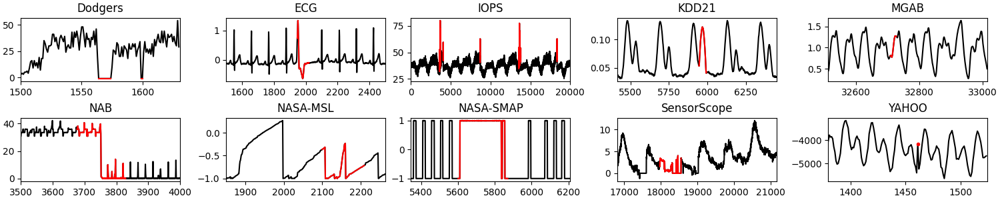
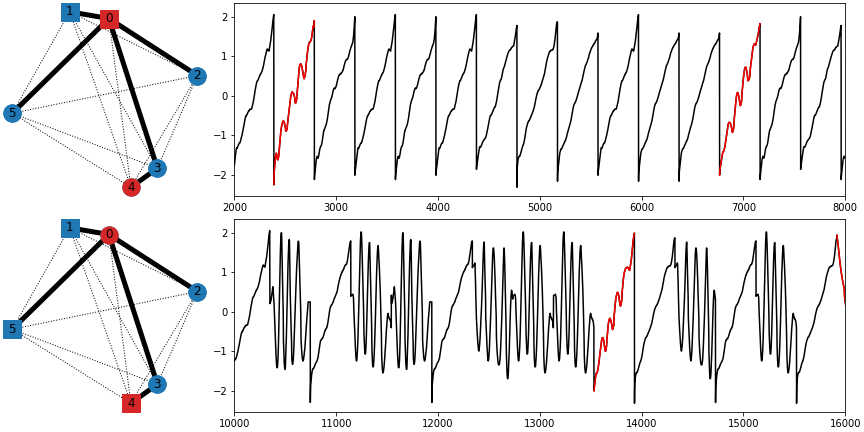
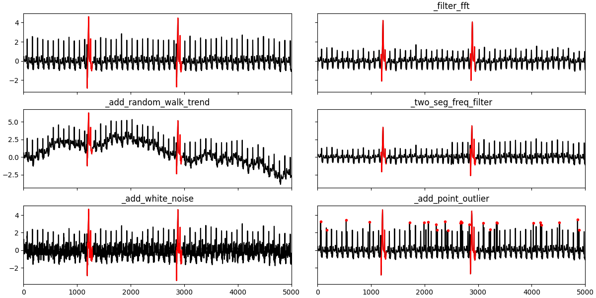
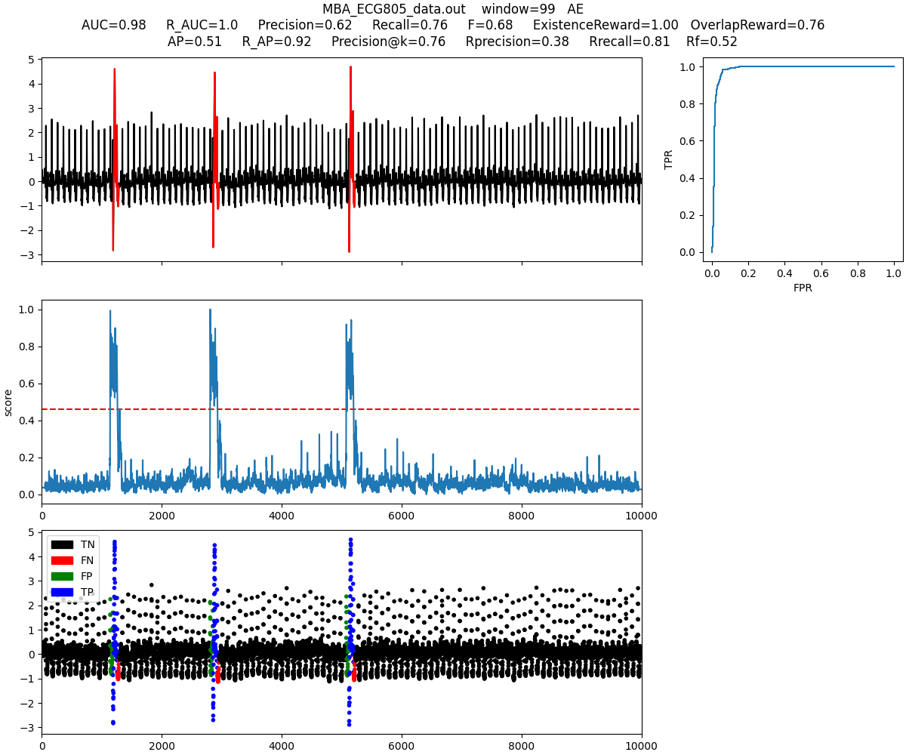

# TSB-UAD: An End-to-End Anomaly Detection Benchmark Suite for Univariate Time-Series Data

TSB-UAD is a new open, end-to-end benchmark suite to ease the
evaluation of univariate time-series anomaly detection methods. Overall, TSB-UAD
contains 12686 time series with labeled anomalies spanning
different domains with high variability of anomaly types, ratios,
and sizes. Specifically, TSB-UAD includes 10 previously proposed
datasets containing 900 time series from real-world data science applications. 
Motivated by flaws in certain datasets and evaluation strategies in the literature,
we study anomaly types and data transformations to contribute
two collections of datasets. Specifically, we generate 958 time series
using a principled methodology for transforming 126 time-series
classification datasets into time series with labeled anomalies. In
addition, we present a set of data transformations with which we
introduce new anomalies in the public datasets, resulting in 10828
time series (92 datasets) with varying difficulty for anomaly detection.

## Publication

If you use TSB-UAD in your project or research, please cite our paper:

John Paparrizos, Yuhao Kang, Paul Boniol, Ruey S. Tsay, Themis Palpanas,
and Michael J. Franklin. TSB-UAD: An End-to-End Benchmark Suite for
Univariate Time-Series Anomaly Detection. PVLDB, 15(8): 1697 - 1711, 2022.
doi:10.14778/3529337.3529354


## Datasets

Due to limitations in the upload size on GitHub, we host the datasets at a different location:

Public: http://chaos.cs.uchicago.edu/tsb-uad/public.zip

Synthetic: http://chaos.cs.uchicago.edu/tsb-uad/synthetic.zip

Artificial: http://chaos.cs.uchicago.edu/tsb-uad/artificial.zip

The UCR classification datasets used to generate the Artificial datasets: http://chaos.cs.uchicago.edu/tsb-uad/UCR2018-NEW.zip

## Contributors

* John Paparrizos (University of Chicago)
* Yuhao Kang (University of Chicago)
* Alex Wu (University of Chicago)
* Teja Bogireddy (University of Chicago)

## Installation

The following tools are required to install TSB-UAD from source:

- git
- conda (anaconda or miniconda)

#### Steps

1. Clone this repository using git and change into its root directory.

```bash
git clone https://github.com/johnpaparrizos/TSB-UAD-Temp.git
cd TSB-UAD-Temp/
```

2. Create and activate a conda-environment 'TSB'.

```bash
conda env create --file environment.yml
conda activate TSB
```

3. Install TSB-UAD using setup.py:

```
python setup.py install
```
   
4. Install the dependencies from `requirements.txt`:
```
pip install -r requirements.txt
```


## Usage
* test_anomaly_detectors.ipynb : The performance of 11 popular anomaly detectors. 
* test_artificialConstruction.ipynb: The synthesized dataset based on anomaly construction. 
* test_transformer.ipynb: The effects of 11 transformations.
## Benchmark 
In ./data contains four folders: 

* benchmark/ contains ten public datasets. Below shows some typical outliers in these ten datasets.


* UCR2018-NEW/ contains 128 subfolders 

* artificial/ contains the data that are constructed based on UCR2018-NEW


* synthetic/ contains the data that are synthesized by local and global tranformations



## Anomaly Detector
We test eleven algorithms in the module.

Below shows a result based on Autoencoder.

For each output figure, the left panel shows the real time series with outliers (red), anomaly score obtained by each anomaly detector, and the correpsonding TP/FP/TN/FN classification.

The right panel shows the ROC curve. AUC represents the area under the ROC curve. Larger AUC indicates better performance.



## AUC result table
auc_public.csv shows the AUC result of 18 datasets in public.zip. There are 2 versions of NASA_MSL and NASA_SMAP. The 1st version gives the complete time series, while the 2nd version gives seperate training data and testing data. OCSVM, AE, CNN and LSTM are trained based on the clean traning data in version 2. For the rest of models, we measure their performance based on version 1.

auc_artificial.csv shows the performance of IForest,MP,NORMA,PCA and POLY on the 958 artificial time series. fileIndex indicates the index of used dataset in the UCR classification datasets. K is the number of anomalous segments. anoR is the ratio of anomalous segments. seed is the random seed used in code. The definition of cr/nc/na can be found in the paper.
