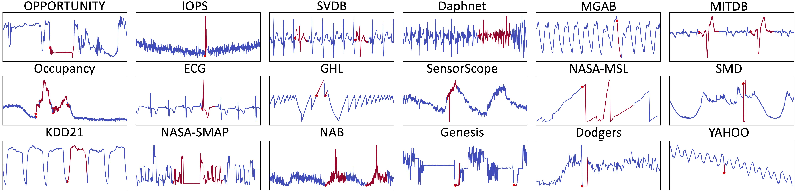
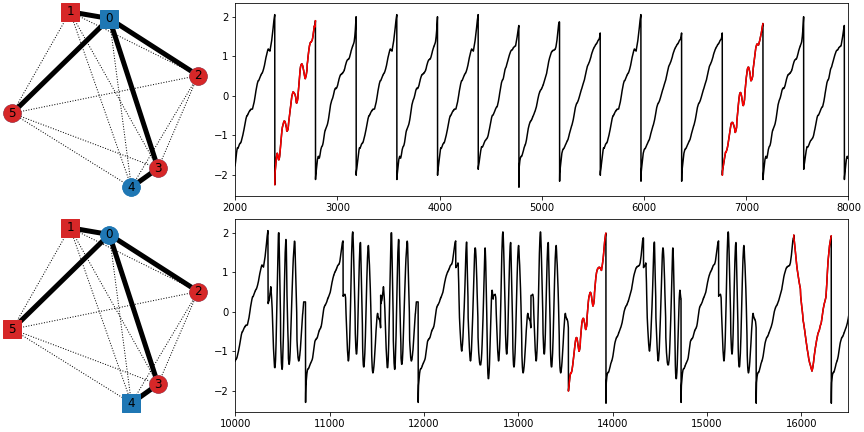
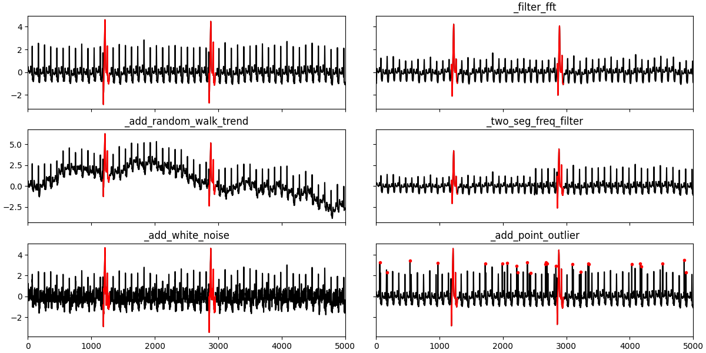
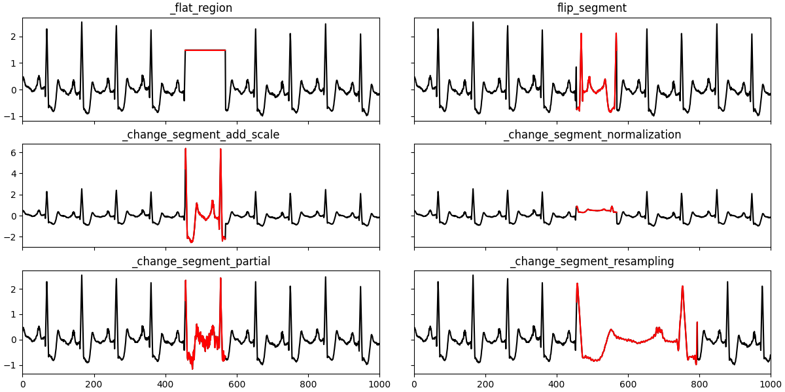
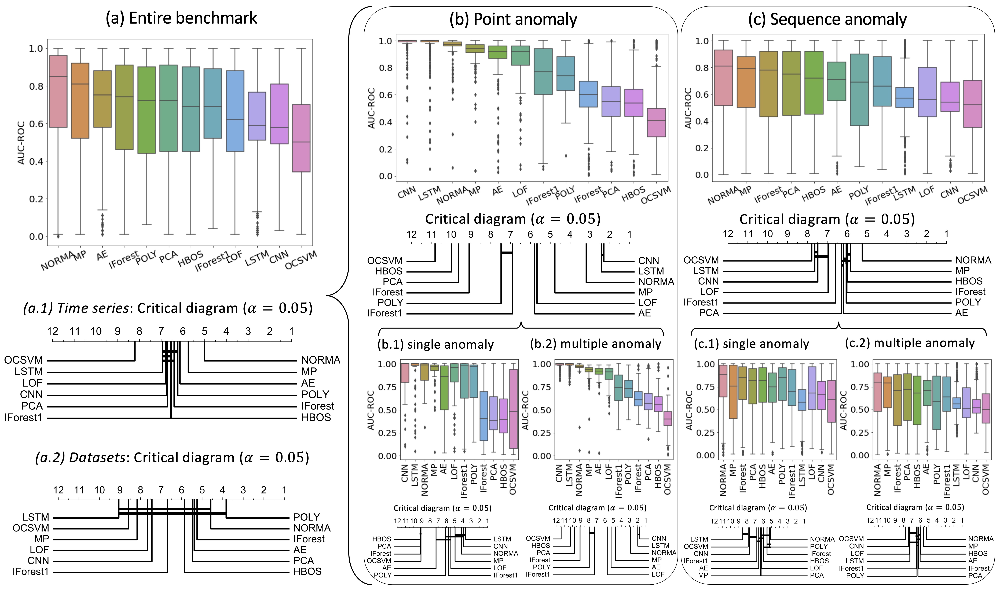

<h1 align="center">TSB-UAD</h1>
<h2 align="center">An End-to-End Benchmark Suite for Univariate Time-Series Anomaly Detection</h2>


TSB-UAD is a new open, end-to-end benchmark suite to ease the
evaluation of univariate time-series anomaly detection methods. Overall, TSB-UAD
contains 12686 time series with labeled anomalies spanning
different domains with high variability of anomaly types, ratios,
and sizes. Specifically, TSB-UAD includes 18 previously proposed
datasets containing 1980 time series from real-world data science applications. 
Motivated by flaws in certain datasets and evaluation strategies in the literature,
we study anomaly types and data transformations to contribute
two collections of datasets. Specifically, we generate 958 time series
using a principled methodology for transforming 126 time-series
classification datasets into time series with labeled anomalies. In
addition, we present a set of data transformations with which we
introduce new anomalies in the public datasets, resulting in 10828
time series (92 datasets) with varying difficulty for anomaly detection.

If you use TSB-UAD in your project or research, cite the following two papers:

* [VLDB 2022a](https://www.paparrizos.org/papers/PaparrizosVLDB22a.pdf)
* [VLDB 2022b](https://www.paparrizos.org/papers/PaparrizosVLDB22b.pdf)

### References

> "TSB-UAD: An End-to-End Benchmark Suite for Univariate Time-Series Anomaly Detection"<br/>
> John Paparrizos, Yuhao Kang, Paul Boniol, Ruey Tsay, Themis Palpanas, and Michael Franklin.<br/>
> Proceedings of the VLDB Endowment (**PVLDB 2022**) Journal, Volume 15, pages 1697–1711<br/>

```bibtex
@article{paparrizos2022tsb,
  title={Tsb-uad: an end-to-end benchmark suite for univariate time-series anomaly detection},
  author={Paparrizos, John and Kang, Yuhao and Boniol, Paul and Tsay, Ruey S and Palpanas, Themis and Franklin, Michael J},
  journal={Proceedings of the VLDB Endowment},
  volume={15},
  number={8},
  pages={1697--1711},
  year={2022},
  publisher={VLDB Endowment}
}
```

> "Volume Under the Surface: A New Accuracy Evaluation Measure for Time-Series Anomaly Detection"<br/>
> John Paparrizos, Paul Boniol, Themis Palpanas, Ruey Tsay, Aaron Elmore, and Michael Franklin<br/>
> Proceedings of the VLDB Endowment (**PVLDB 2022**) Journal, Volume 15, pages 2774‑2787<br/>

```bibtex
@article{paparrizos2022volume,
  title={{Volume Under the Surface: A New Accuracy Evaluation Measure for Time-Series Anomaly Detection}},
  author={Paparrizos, John and Boniol, Paul and Palpanas, Themis and Tsay, Ruey S and Elmore, Aaron and Franklin, Michael J},
  journal={Proceedings of the VLDB Endowment},
  volume={15},
  number={11},
  pages={2774--2787},
  year={2022},
  publisher={VLDB Endowment}
}

```

> "Local Evaluation of Time Series Anomaly Detection Algorithms", 
> Accepted in KDD 2022 Research Track: Proceedings of the 28th ACM SIGKDD Conference on Knowledge Discovery and Data Mining.
>  [Affiliation Metrics](https://github.com/ahstat/affiliation-metrics-py)

## Contributors

* John Paparrizos (University of Chicago)
* Yuhao Kang (University of Chicago)
* Alex Wu (University of Chicago)
* Teja Bogireddy (University of Chicago)
* Paul Boniol (Université Paris Cité)


## Installation

The following tools are required to install TSB-UAD from source:

- git
- conda (anaconda or miniconda)

#### Steps

1. First, due to limitations in the upload size on GitHub, we host the datasets at a different location. Please download the datasets using the following links:

- Public: https://www.thedatum.org/datasets/TSB-UAD-Public.zip

- Synthetic: https://www.thedatum.org/datasets/TSB-UAD-Synthetic.zip

- Artificial: https://www.thedatum.org/datasets/TSB-UAD-Artificial.zip

- - The UCR classification datasets used to generate the Artificial datasets: https://www.thedatum.org/datasets/UCR2022_DATASETS.zip

2. Clone this repository using git and change into its root directory.

```bash
git clone https://github.com/johnpaparrizos/TSB-UAD.git
cd TSB-UAD/
```

3. Create and activate a conda-environment 'TSB'.

```bash
conda env create --file environment.yml
conda activate TSB
```
   
4. Install the dependencies from `requirements.txt`:
```
pip install -r requirements.txt
```

5. Install TSB-UAD:

```
pip install .
```

## Benchmark 

All are datasets and time series are stored in ./data. We describe below the different types of datasets used in our benchmark.

### Benchmark: Public Real Datasets 

We first collected 18 public datasets from heterogeneous domains (you may find them in benchmark/).
The figure below shows some typical outliers in these 18 datasets.

<p align="center">

</p>

Briefly, TSB-UAD includes the following datasets:

| Dataset    | Description|
|:--|:---------:|
|Dodgers| is a loop sensor data for the Glendale on-ramp for the 101 North freeway in Los Angeles and the anomalies represent unusual traffic after a Dodgers game.|
|ECG| is a standard electrocardiogram dataset and the anomalies represent ventricular premature contractions. We split one long series (MBA_ECG14046) with length ∼ 1e7) to 47 series by first identifying the periodicity of the signal.|
|IOPS| is a dataset with performance indicators that reflect the scale, quality of web services, and health status of a machine.|
|KDD21| is a composite dataset released in a recent SIGKDD 2021 competition with 250 time series.|
|MGAB| is composed of Mackey-Glass time series with non-trivial anomalies. Mackey-Glass time series exhibit chaotic behavior that is difficult for the human eye to distinguish.|
|NAB| is composed of labeled real-world and artificial time series including AWS server metrics, online advertisement clicking rates, real time traffic data, and a collection of Twitter mentions of large publicly-traded companies.|
|NASA-SMAP and NASA-MSL| are two real spacecraft telemetry data with anomalies from Soil Moisture Active Passive (SMAP) satellite and Curiosity Rover on Mars (MSL). We only keep the first data dimension that presents the continuous data, and we omit the remaining dimensions with binary data.|
|SensorScope| is a collection of environmental data, such as temperature, humidity, and solar radiation, collected from a typical tiered sensor measurement system.|
|YAHOO| is a dataset published by Yahoo labs consisting of real and synthetic time series based on the real production traffic to some of the Yahoo production systems.|
|Daphnet| contains the annotated readings of 3 acceleration sensors at the hip and leg of Parkinson’s disease patients that experience freezing of gait (FoG) during walking tasks.|
|GHL| is a Gasoil Heating Loop Dataset and contains the status of 3 reservoirs such as the temperature and level. Anomalies indicate changes in max temperature or pump frequency.|
|Genesis| is a portable pick-and-place demonstrator which uses an air tank to supply all the gripping and storage units.|
|MITDB| contains 48 half-hour excerpts of two-channel ambulatory ECG recordings, obtained from 47 subjects studied by the BIH Arrhythmia Laboratory between 1975 and 1979.|
|OPPORTUNITY (OPP)| is a dataset devised to benchmark human activity recognition algorithms (e.g., classiffication, automatic data segmentation, sensor fusion, and feature extraction). The dataset comprises the readings of motion sensors recorded while users executed typical daily activities.|
|Occupancy| contains experimental data used for binary classiffication (room occupancy) from temperature, humidity, light, and CO2. Ground-truth occupancy was obtained from time stamped pictures that were taken every minute.|
|SMD (Server Machine Dataset)| is a 5-week-long dataset collected from a large Internet company. This dataset contains 3 groups of entities from 28 different machines.|
|SVDB| includes 78 half-hour ECG recordings chosen to supplement the examples of  supraventricular arrhythmias in the MIT-BIH Arrhythmia Database.|

The following table summarizes different characteristics of the datasets.


| Dataset    | Count |	Average length |	Average number of anomalies |	Average number of abnormal points |
|:--|:---------:|:-------:|:--------:|:-------:|
|Dodger     | 1     |	50400.0        |	133.0                       |	5612                              |
|ECG        | 52    |	230351.9       |	195.6                       |	15634                             |
|IOPS       | 58    |	102119.2       |	46.5                        |	2312.3                            |
|KDD21      | 250   |	77415.06       |	1.0                         |	196.5                             |
|MGAB       | 10    |	100000.0       |	10.0                        |	200.0                             |
|NAB        | 58    |	6301.7         |	2.0                         |	575.5                             |
|SensorScope| 23    |	27038.4        |	11.2                        |	6110.4                            |
|YAHOO      | 367   |	1561.2         |	5.9                         |	10.7                              |
|NASA-MSL   | 27    |	2730.7         |	1.33                        |	286.3                             |
|NASA-SMAP  | 54    |	8066.0         |	1.26                        |	1032.4                            |
|Daphnet    | 45    |	21760.0        |	7.6                         |	2841.0                            |
|GHL        | 126   |	200001.0       |	1.2                         |	388.8                             |
|Genesis    | 6     |	16220.0        |	3.0                         |	50.0                              |
|MITDB      | 32    |	650000.0       |	210.1                       |	72334.3                           |
|OPP        | 465   |	31616.9        |	2.0                         |	1267.3                            |
|Occupancy  | 10    |	5725.8         |	18.3                        |	1414.5                            |
|SMD        | 281   |	25562.3        |	10.4                        |	900.2                             |
|SVDB       | 115   |	230400.0       |	208.0                       |	27144.5                           |

You may find more details (and the references) in our [paper](https://www.paparrizos.org/papers/PaparrizosVLDB22a.pdf).

### Benchmark: Synthetic and Artificial Datasets 

We also include synthetic and artifical datasets. We construct and transformed dataset based on the UCR archive (you may find them in UCR2018-NEW/ which contains 128 subfolders). The synthetic and artifical datasets are stored here:

* **artificial/** contains the data that are constructed based on UCR2018-NEW. Below is a figure illustrating the construction process.

<p align="center">

</p>

* **synthetic/** contains the data that are synthesized by local and global tranformations. Below is a figure illustrating the transformation process.
<p align="center">

</p>
<p align="center">

</p>

## Anomaly Detectors

We use 13 anomaly detection methods proposed for univariate time series. the following table lists and describes the methods considered in our benchmark:

| Anomaly Detection Method    | Description|
|:--|:---------:|
|Isolation Forest (IForest) | This method constructs the binary tree based on the space splitting and the nodes with shorter path lengths to the root are more likely to be anomalies. |
|The Local Outlier Factor (LOF)| This method computes the ratio of the neighboring density to the local density. |
|The Histogram-based Outlier Score (HBOS)| This method constructs a histogram for the data and the inverse of the height of the bin is used as the outlier score of the data point. |
|Matrix Profile (MP)| This method calculates as anomaly the subsequence with the most significant 1-NN distance. |
|NORMA| This method identifies the normal pattern based on clustering and calculates each point's effective distance to the normal pattern. |
|Principal Component Analysis (PCA)| This method projects data to a lower-dimensional hyperplane, and data points with a significant distance from this plane can be identified as outliers. |
|Autoencoder (AE)|This method projects data to the lower-dimensional latent space and reconstructs the data, and outliers are expected to have more evident reconstruction deviation. |
|LSTM-AD| This method build a non-linear relationship between current and previous time series (using Long-Short-Term-Memory cells), and the outliers are detected by the deviation between the predicted and actual values. |
|Polynomial Approximation (POLY)| This method build a non-linear relationship between current and previous time series (using polynomial decomposition), and the outliers are detected by the deviation between the predicted and actual values. |
| CNN | This method build a non-linear relationship between current and previous time series (using convolutional Neural Network), and the outliers are detected by the deviation between the predicted and actual values. |
|One-class Support Vector Machines (OCSVM)| This method fits the dataset to find the normal data's boundary. |
|*Discord Aware Matrix Profile (DAMP)*| *This method is a scalable matrix Profile-based approach proposed to solves the twin-freak problem.* |
|*SAND*| *This method identifies the normal pattern based on clustering updated through arriving batches (i.e., subsequences) and calculates each point's effective distance to the normal pattern. This method can be used either online and offline.* |
|*Series2Graph*| *This method is converting the time series into a directed graph reprenting the evolution of subsequences in time. The anomalies are detected using the weight and the degree of the nodes and edges respectively.* |

You may find more details (and the references) in our [paper](https://www.paparrizos.org/papers/PaparrizosVLDB22b.pdf). In italics are methods that are available but not evaluated yet.

## Overall Results

We report in the following table the average AUC-ROC and F score for each method on each dataset. The accuracy scores are averaged for all the time series in each dataset. 

| Datasets | IForest | | IForest1| | LOF| | MP| | PCA| | NORMA| | HBOS| | POLY| | OCSVM| | AE| | CNN| | LSTM| |
|-------------|---------------|------|---------------|------|---------------|------|---------------|------|------|------|---------------|------|---------------|------|---------------|------|------|------|------|------|---------------|------|------|------|
|             | AUC           | F    | AUC           | F    | AUC           | F    | AUC           | F    | AUC  | F    | AUC           | F    | AUC           | F    | AUC           | F    | AUC  | F    | AUC  | F    | AUC           | F    | AUC  | F    |
| Dodgers     | 0.79          | 0.16 | 0.64          | 0.02 | 0.54          | 0.10 | 0.52          | 0.19 | 0.77 | 0.26 | **0.79**   | 0.19 | 0.3           | 0.00 | 0.69          | 0.10 | 0.64 | 0.00 | 0.73 | 0.08 | 0.68          | 0.06 | 0.39 | 0.04 |
| ECG         | 0.75          | 0.27 | 0.61          | 0.18 | 0.56          | 0.09 | 0.58          | 0.12 | 0.71 | 0.25 | **0.95** | 0.33 | 0.68          | 0.20 | 0.70          | 0.24 | 0.64 | 0.17 | 0.73 | 0.21 | 0.52          | 0.03 | 0.54 | 0.03 |
| IOPS        | 0.54          | 0.04 | **0.78** | 0.25 | 0.50          | 0.08 | 0.72          | 0.10 | 0.74 | 0.17 | 0.76          | 0.12 | 0.64          | 0.11 | 0.68          | 0.11 | 0.71 | 0.14 | 0.63 | 0.13 | 0.61          | 0.09 | 0.61 | 0.10 |
| MGAB        | 0.57          | 0.00 | 0.58          | 0.00 | **0.96** | 0.62 | 0.91          | 0.24 | 0.54 | 0.00 | 0.55          | 0.00 | 0.54          | 0.00 | 0.51          | 0.00 | 0.52 | 0.00 | 0.71 | 0.06 | 0.58          | 0.04 | 0.56 | 0.03 |
| NAB         | 0.45          | 0.05 | 0.56          | 0.10 | 0.48          | 0.07 | 0.49          | 0.05 | 0.69 | 0.16 | 0.58          | 0.05 | 0.68          | 0.11 | **0.75** | 0.14 | 0.61 | 0.09 | 0.54 | 0.07 | 0.52          | 0.06 | 0.50 | 0.05 |
| NASA-MSL    | 0.57          | 0.04 | 0.69          | 0.21 | 0.52          | 0.03 | 0.52          | 0.00 | 0.75 | 0.23 | 0.55          | 0.00 | 0.77          | 0.21 | **0.81** | 0.24 | 0.64 | 0.12 | 0.70 | 0.14 | 0.57          | 0.14 | 0.57 | 0.13 |
| NASA-SMAP   | 0.72          | 0.21 | 0.68          | 0.13 | 0.68          | 0.20 | 0.62          | 0.18 | 0.74 | 0.25 | 0.80          | 0.19 | 0.77          | 0.27 | **0.80** | 0.20 | 0.65 | 0.31 | 0.77 | 0.33 | 0.68          | 0.17 | 0.64 | 0.14 |
| SensorScope | 0.56          | 0.00 | 0.56          | 0.06 | 0.55          | 0.09 | 0.50          | 0.02 | 0.54 | 0.05 | 0.59          | 0.01 | 0.56          | 0.02 | **0.62** | 0.09 | 0.51 | 0.04 | 0.52 | 0.03 | 0.52          | 0.04 | 0.53 | 0.05 |
| YAHOO       | 0.62          | 0.06 | 0.81          | 0.18 | 0.86          | 0.11 | 0.86          | 0.06 | 0.57 | 0.06 | 0.92          | 0.11 | 0.57          | 0.07 | 0.76          | 0.08 | 0.50 | 0.03 | 0.79 | 0.06 | **0.96** | 0.47 | 0.94 | 0.46 |
| KDD21       | 0.65          | 0.09 | 0.57          | 0.02 | 0.78          | 0.17 | **0.90** | 0.22 | 0.58 | 0.07 | 0.88          | 0.22 | 0.60          | 0.06 | 0.58          | 0.04 | 0.60 | 0.16 | 0.79 | 0.16 | 0.74          | 0.12 | 0.66 | 0.08 |
| Daphnet     | 0.74          | 0.06 | 0.68          | 0.08 | **0.78** | 0.08 | 0.44          | 0.00 | 0.69 | 0.05 | 0.46          | 0.00 | 0.69          | 0.04 | 0.77          | 0.08 | 0.45 | 0.01 | 0.44 | 0.01 | 0.47          | 0.01 | 0.44 | 0.02 |
| GHL         | **0.94** | 0.07 | 0.94          | 0.06 | 0.54          | 0.00 | 0.42          | 0.01 | 0.91 | 0.02 | 0.64          | 0.00 | 0.92          | 0.02 | 0.76          | 0.02 | 0.45 | 0.02 | 0.63 | 0.01 | 0.47          | 0.00 | 0.47 | 0.00 |
| Genesis     | 0.78          | 0.00 | 0.66          | 0.19 | 0.68          | 0.00 | 0.35          | 0.00 | 0.85 | 0.00 | 0.6           | 0.00 | 0.59          | 0.00 | **0.87** | 0.32 | 0.70 | 0.03 | 0.72 | 0.01 | 0.73          | 0.02 | 0.53 | 0.01 |
| MITDB       | 0.70          | 0.09 | 0.61          | 0.06 | 0.61          | 0.09 | 0.69          | 0.11 | 0.67 | 0.09 | **0.86** | 0.20 | 0.70          | 0.07 | 0.68          | 0.11 | 0.65 | 0.13 | 0.80 | 0.17 | 0.58          | 0.05 | 0.51 | 0.02 |
| OPP         | 0.49          | 0.07 | 0.52          | 0.03 | 0.45          | 0.10 | **0.82** | 0.01 | 0.52 | 0.15 | 0.65          | 0.06 | 0.54          | 0.09 | 0.28          | 0.01 | 0.38 | 0.01 | 0.70 | 0.07 | 0.47          | 0.01 | 0.57 | 0.08 |
| Occupancy   | 0.86          | 0.03 | 0.78          | 0.07 | 0.53          | 0.04 | 0.32          | 0.00 | 0.78 | 0.08 | 0.53          | 0.00 | **0.89** | 0.02 | 0.80          | 0.13 | 0.66 | 0.02 | 0.69 | 0.02 | 0.79          | 0.04 | 0.71 | 0.02 |
| SMD         | 0.85          | 0.35 | 0.73          | 0.25 | 0.69          | 0.18 | 0.51          | 0.03 | 0.80 | 0.31 | 0.61          | 0.03 | 0.77          | 0.31 | **0.87** | 0.41 | 0.61 | 0.11 | 0.63 | 0.09 | 0.61          | 0.08 | 0.58 | 0.07 |
| SVDB        | 0.72          | 0.19 | 0.58          | 0.08 | 0.59          | 0.14 | 0.74          | 0.17 | 0.68 | 0.19 | **0.92** | 0.33 | 0.71          | 0.15 | 0.67          | 0.18 | 0.68 | 0.15 | 0.79 | 0.18 | 0.58          | 0.07 | 0.55 | 0.06 |

Here we only report the average accuracy (AUC-ROC and F score) for each dataset. You may find [here](https://github.com/TheDatumOrg/TSB-UAD/tree/main/result/accuracy_table) the accuracy tables for each time series and each accuracy measure.

We then compare the accuracy scores of the anoamly detection methods on time series containing point versus sequence anomalies and a single versus multiple anomalies. The following figure summarize the results:

<p align="center">

</p>

This figure and many others comparisons are described (and reproductible) in [this notebook](https://github.com/TheDatumOrg/TSB-UAD/blob/main/result/accuracy_evaluation/Statistical_Analysis_TSB.ipynb), summarized in [this document](https://github.com/TheDatumOrg/TSB-UAD/blob/main/result/accuracy_evaluation/Statistical_Analysis_TSB.pdf).
The scripts to reproduce the critical diagrams and the statistical tests are [here](https://github.com/TheDatumOrg/TSB-UAD/tree/main/result/statistical_test).


## Usage

### Anomaly Detector

We depicts below a code snippet demonstrating how to use one anomaly detector (in this example, IForest).

```python
import os
import pandas as pd
from TSB_UAD.core import tsb_uad


df = pd.read_csv('data/benchmark/ECG/MBA_ECG805_data.out', header=None).to_numpy()
data = df[:, 0].astype(float)
label = df[:, 1]
results = tsb_uad(data, label, 'IForest', metric='all')

metrics = {}
for metric in results.keys():
    metrics[metric] = [results[metric]]
    print(metric, ':', results[metric])

df = pd.DataFrame(data=metrics)
df.to_csv(os.path.join('./all_metrics.csv'))
```

```
AUC_ROC : 0.9216216369841076
AUC_PR : 0.6608577550833885
Precision : 0.7342093339374717
Recall : 0.4010891089108911
F : 0.5187770129662238
Precision_at_k : 0.4010891089108911
Rprecision : 0.7486112853253205
Rrecall : 0.3097733542316151
RF : 0.438214653167952
R_AUC_ROC : 0.989123018780308
R_AUC_PR : 0.9435238401582703
VUS_ROC : 0.9734357459251715
VUS_PR : 0.8858037295594041
Affiliation_Precision : 0.9630674176380548
Affiliation_Recall : 0.9809813654809071
```

You may find more details on how to run each anomaly detection method in this [notebook](https://github.com/TheDatumOrg/TSB-UAD/blob/main/example/notebooks/test_anomaly_detectors.ipynb) and this [script](https://github.com/TheDatumOrg/TSB-UAD/blob/main/example/scripts/anomaly_detectors.py).


### Build Artifical Dataset

You may find details and examples on how to create artifical datasets in this [notebook](https://github.com/TheDatumOrg/TSB-UAD/blob/main/example/notebooks/test_artificialConstruction.ipynb) and this [script](https://github.com/TheDatumOrg/TSB-UAD/blob/main/example/scripts/generate_artificial_dataset.py)


### Apply Transformations to a Dataset

You may find details and examples on how to apply transformations on a dataset in this [notebook](https://github.com/TheDatumOrg/TSB-UAD/blob/main/example/notebooks/test_transformer.ipynb) and this [script](https://github.com/TheDatumOrg/TSB-UAD/blob/main/example/scripts/generate_transformed_data.py)
