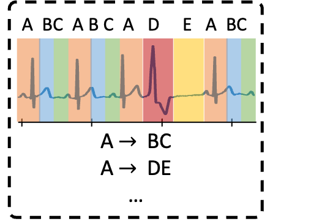
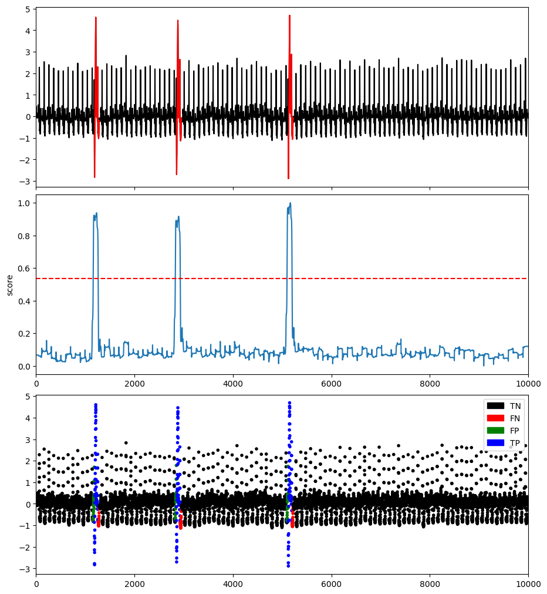
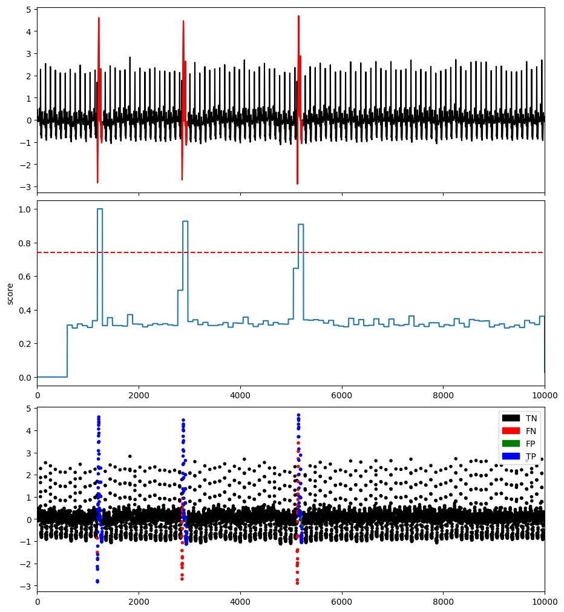

# Encoding-based methods

## Principal Component Analysis-based Anomaly Detection (PCA)

The first encoding-based approach is to encode and represent the time series with its principal components. Principal Components Analysis (PCA) investigates the major components of the time series that contribute the most to the covariance structure. The anomaly score is measured by the sub-sequences distance from 0 along the principal components weighted by their eigenvalues. Please see [Aggarwal 2015] for mre details.


The TSB-kit implementation of PCA is adapted from [PyOD implementation](https://pyod.readthedocs.io/en/latest/) [Zhao et al. 2019].

```{eval-rst}  
.. autoclass:: TSB_UAD.models.pca.PCA
    :members:

```

### Example

```python
import os
import numpy as np
import pandas as pd
from TSB_UAD.utils.visualisation import plotFig
from TSB_UAD.models.pca import PCA
from TSB_UAD.models.feature import Window
from TSB_UAD.utils.slidingWindows import find_length
from TSB_UAD.vus.metrics import get_metrics

#Read data
filepath = 'PATH_TO_TSB_UAD/ECG/MBA_ECG805_data.out'
df = pd.read_csv(filepath, header=None).dropna().to_numpy()
name = filepath.split('/')[-1]

data = df[:,0].astype(float)
label = df[:,1].astype(int)

#Pre-processing    
slidingWindow = find_length(data)
X_data = Window(window = slidingWindow).convert(data).to_numpy()


#Run PCA
modelName='PCA'
clf = PCA()
clf.fit(X_data)
score = clf.decision_scores_

# Post-processing
score = MinMaxScaler(feature_range=(0,1)).fit_transform(score.reshape(-1,1)).ravel()
score = np.array([score[0]]*math.ceil((slidingWindow-1)/2) + list(score) + [score[-1]]*((slidingWindow-1)//2))


#Plot result
plotFig(data, label, score, slidingWindow, fileName=name, modelName=modelName) 

#Print accuracy
results = get_metrics(score, label, metric="all", slidingWindow=slidingWindow)
for metric in results.keys():
    print(metric, ':', results[metric])
```
```
AUC_ROC : 0.9831757023284056
AUC_PR : 0.7572161269856095
Precision : 0.7752442996742671
Recall : 0.7854785478547854
F : 0.7803278688524591
Precision_at_k : 0.7854785478547854
Rprecision : 0.77530626365804
Rrecall : 0.8284808873044168
RF : 0.8010120555743515
R_AUC_ROC : 0.9994595750446229
R_AUC_PR : 0.9836739288859631
VUS_ROC : 0.997118940672939
VUS_PR : 0.9475589866373976
Affiliation_Precision : 0.9890337001400605
Affiliation_Recall : 0.9982808225194953
```


### References

* [Aggarwal 2015] Charu C Aggarwal. Outlier analysis. In Data mining, 75–79. Springer, 2015.

* [Zhao et al. 2019] Zhao, Yue, Zain Nasrullah and Zheng Li. PyOD: A Python Toolbox for Scalable Outlier Detection. J. Mach. Learn. Res. 20,2019.
 

## Polynomial Approximation (POLY)


POLY is a encoding-based anoamly detection methods that aims to detect pointwise anomalies using polynomial approximation [Li et al. 2007]. A polynomial of certain degree and window size is fitted to the given time series dataset. A GARCH [Bollerslev 1986] method is ran on the difference betweeen the approximation and the true value of the dataset to estimate the volatitilies of each point. A score is derived on each point based on the estimated volatitilies and residual to measure the normality of each point. An alternative method that only considers absolute difference is also used.


```{eval-rst}  
.. autoclass:: TSB_UAD.models.poly.POLY
    :members:

```

### Example

```python
import os
import numpy as np
import pandas as pd
from TSB_UAD.utils.visualisation import plotFig
from TSB_UAD.models.distance import Fourier
from TSB_UAD.models.poly import POLY
from TSB_UAD.models.feature import Window
from TSB_UAD.utils.slidingWindows import find_length
from TSB_UAD.vus.metrics import get_metrics

#Read data
filepath = 'PATH_TO_TSB_UAD/ECG/MBA_ECG805_data.out'
df = pd.read_csv(filepath, header=None).dropna().to_numpy()
name = filepath.split('/')[-1]

data = df[:,0].astype(float)
label = df[:,1].astype(int)

#Pre-processing    
slidingWindow = find_length(data)


#Run POLY
modelName='POLY'
clf = POLY(power=3, window = slidingWindow)
clf.fit(data)
measure = Fourier()
measure.detector = clf
measure.set_param()
clf.decision_function(measure=measure)
score = clf.decision_scores_

# Post-processing
score = MinMaxScaler(feature_range=(0,1)).fit_transform(score.reshape(-1,1)).ravel()

#Plot result
plotFig(data, label, score, slidingWindow, fileName=name, modelName=modelName) 

#Print accuracy
results = get_metrics(score, label, metric="all", slidingWindow=slidingWindow)
for metric in results.keys():
    print(metric, ':', results[metric])
```
```
AUC_ROC : 0.9958617394172128
AUC_PR : 0.8837102941063337
Precision : 0.8686868686868687
Recall : 0.8514851485148515
F : 0.86
Precision_at_k : 0.8514851485148515
Rprecision : 0.8686868686868686
Rrecall : 0.8821944939591999
RF : 0.875388577295774
R_AUC_ROC : 0.9966496859473177
R_AUC_PR : 0.9632279391916059
VUS_ROC : 0.9939772090687404
VUS_PR : 0.9465631009222253
Affiliation_Precision : 0.9810555530560522
Affiliation_Recall : 0.9999934905686477
```


### References

* [Li et al. 2007] Z. Li, H. Ma, and Y. Mei. 2007. A unifying method for outlier and change detection from data streams based on local polynomial fitting. In Z.-H. Zhou, H. Li, and Q. Yang, eds., Advances in Knowledge Discovery and Data Mining, pp. 150–161. Springer Berlin Heidelberg, Berlin, Heidelberg. ISBN 978-3-540-71701-0.

* [Bollerslev 1986] Tim Bollerslev, Generalized autoregressive conditional heteroskedasticity, Journal of Econometrics, Volume 31, Issue 3, 1986, ISSN 0304-4076.
