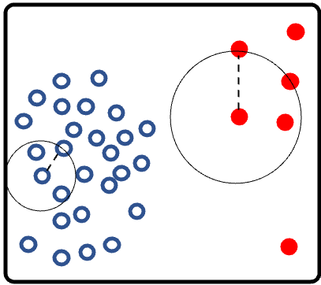
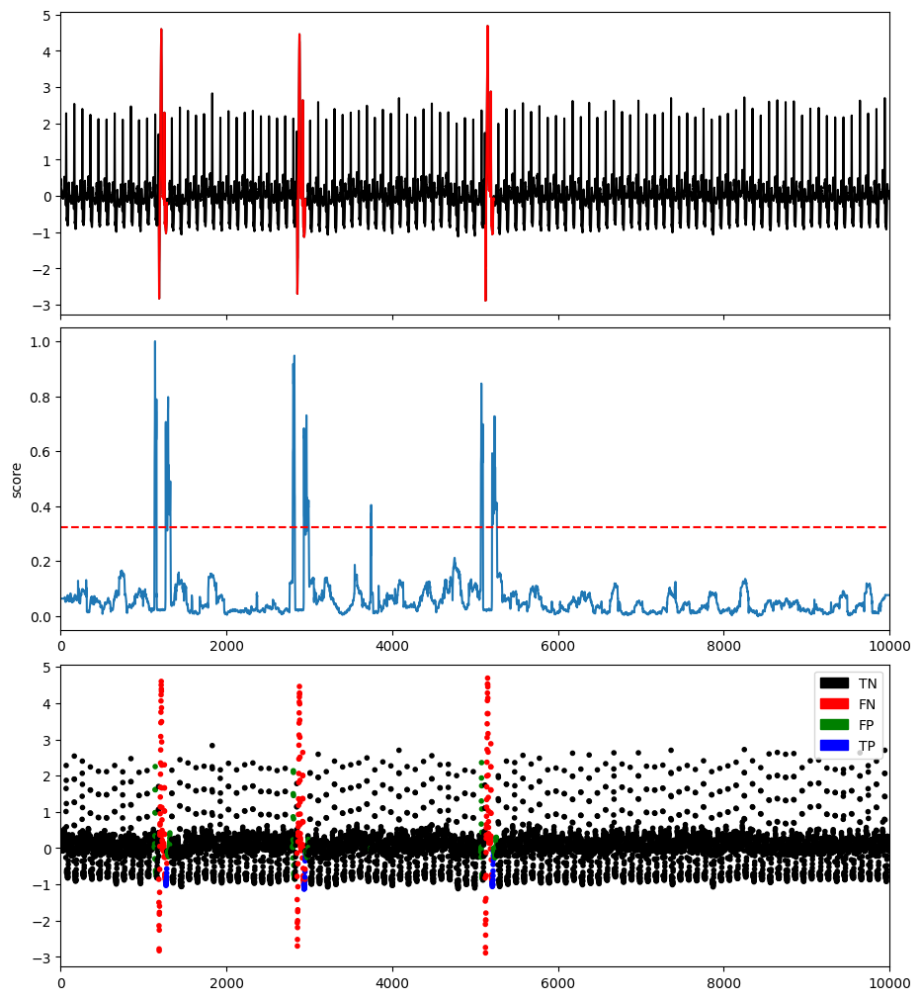

# Proximity-based methods

## Local Outlier Factor (LOF)

The most commonly used proximity-based approach is the Local Outlier Factor (LOF) [Breunig et al. 2000], which measures the degree of being an outlier for each instance. Unlike the previous proximity-based models, which directly compute the distance of sub-sequences, LOF depends on how the instance is isolated to the surrounding neighborhood. This method aims to solve the outlier detection task where an outlier is considered as *an observation that deviates so much from other observations as to arouse suspicion that it was generated by a different mechanism* (Hawkins definition [Hawkins 1980]). This definition is coherent with the anomaly detection task in time series where the *different mechanism* can be either an arrhythmia in an electrocardiogram or a failure in the components of an industrial machine.

The TSB-UAD implementation of LOF is a wrapper of [Scikit-learn implementation of LOF](https://scikit-learn.org/stable/modules/generated/sklearn.neighbors.LocalOutlierFactor.html).


```{eval-rst}  
.. autoclass:: TSB_UAD.models.lof.LOF
    :members:

```

### Example

```python
import os
import numpy as np
import pandas as pd
from TSB_UAD.utils.visualisation import plotFig
from TSB_UAD.models.lof import LOF
from TSB_UAD.models.feature import Window
from TSB_UAD.utils.slidingWindows import find_length
from TSB_UAD.vus.metrics import get_metrics

#Read data
filepath = 'PATH_TO_TSB_UAD/ECG/MBA_ECG805_data.out'
df = pd.read_csv(filepath, header=None).dropna().to_numpy()
name = filepath.split('/')[-1]

data = df[:,0].astype(float)
label = df[:,1].astype(int)

#Pre-processing    
slidingWindow = find_length(data)
X_data = Window(window = slidingWindow).convert(data).to_numpy()

# Run LOF
modelName='LOF'
clf = LOF(n_neighbors=20, n_jobs=1)
clf.fit(X_data)
score = clf.decision_scores_

#Post-processing
score = MinMaxScaler(feature_range=(0,1)).fit_transform(score.reshape(-1,1)).ravel()
score = np.array([score[0]]*math.ceil((slidingWindow-1)/2) + list(score) + [score[-1]]*((slidingWindow-1)//2))


#Plot result
plotFig(data, label, score, slidingWindow, fileName=name, modelName=modelName)

#Print accuracy
results = get_metrics(score, label, metric="all", slidingWindow=slidingWindow)
for metric in results.keys():
    print(metric, ':', results[metric])
```
```
AUC_ROC : 0.41096068975774547
AUC_PR : 0.048104473111295544
Precision : 0.21794871794871795
Recall : 0.16831683168316833
F : 0.1899441340782123
Precision_at_k : 0.16831683168316833
Rprecision : 0.3095238095238095
Rrecall : 0.304812834224599
RF : 0.3071502590673575
R_AUC_ROC : 0.6916553096198312
R_AUC_PR : 0.4549204085910081
VUS_ROC : 0.6545868021121983
VUS_PR : 0.35228784121262147
Affiliation_Precision : 0.942248287092041
Affiliation_Recall : 0.978882103900466
```


### References

* [Breunig et al. 2000] M. M. Breunig, H.-P. Kriegel, R. T. Ng, and J. Sander. 2000b. Lof: identifying density-based local outliers. In Proceedings of the 2000 ACM SIGMOD international conference on Management of data, pp. 93–104.

* [Hawkins 1980] D. M. Hawkins. 1980. Identification of Outliers. Springer Netherlands, Dordrecht.

