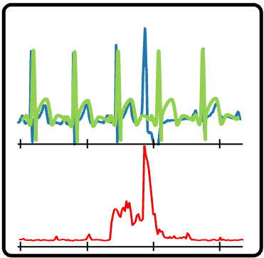
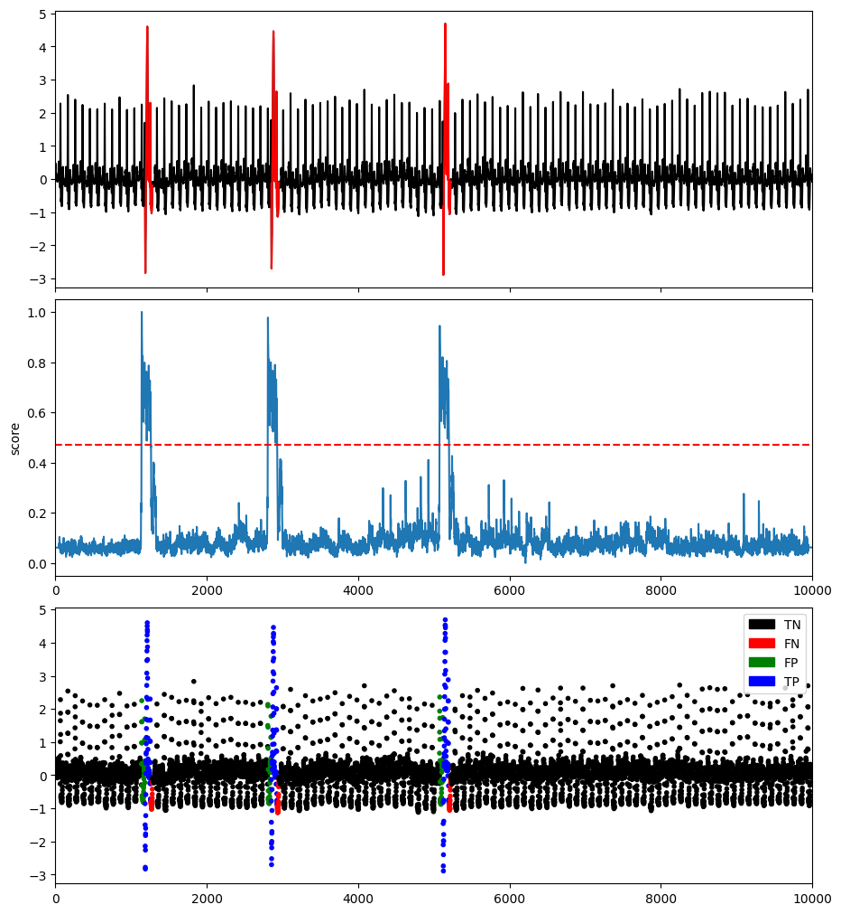

# Reconstruction-based methods

## AutoEncoder (AE)

Autoencoder is a type of artificial neural network used to learn to reconstruct the dataset given as input using a smaller encoding size to avoid identity reconstruction. As a general idea, the autoencoder will try to learn the best latent representation (also called encoding) using a reconstruction loss. Therefore, it will learn to compress the dataset into a shorter code and then uncompress it into a dataset that closely matches the original. 

The reconstruction error can be used as an anomalous score for the specific anomaly detection task. As the model is trained on the non-anomalous subsequence of the time series (or very few anomalous subsequence), it is optimized to reconstruct the normal subsequences. Therefore, all the subsequences far from the training set will have a bigger reconstruction error.

As autoencoder has been a popular method in the recent decade, many anomaly detection algorithms are based on autoencoder algorithms' implementation. For TSB-UAD autoencoder implementation, we use a simple encoder with two consecutive dense layers (32 and 16 neurons respectivelly) for the encoder and the decoder.

```{eval-rst}  
.. autoclass:: TSB_UAD.models.AE.AE_MLP2
    :members:

```

### Example

```python
import os
import numpy as np
import pandas as pd
from TSB_UAD.utils.visualisation import plotFig
from TSB_UAD.models.AE import AE_MLP2
from TSB_UAD.models.feature import Window
from TSB_UAD.utils.slidingWindows import find_length
from TSB_UAD.vus.metrics import get_metrics

#Read data
filepath = 'PATH_TO_TSB_UAD/ECG/MBA_ECG805_data.out'
df = pd.read_csv(filepath, header=None).dropna().to_numpy()
name = filepath.split('/')[-1]

data = df[:,0].astype(float)
label = df[:,1].astype(int)

#Pre-processing    
slidingWindow = find_length(data)

data_train = data[:int(0.1*len(data))]
data_test = data


#Run AE
modelName='AE'
clf = AE_MLP2(slidingWindow = slidingWindow, epochs=100, verbose=0)
clf.fit(data_train, data_test)
score = clf.decision_scores_

# Post-processing
score = MinMaxScaler(feature_range=(0,1)).fit_transform(score.reshape(-1,1)).ravel()
#Plot result
plotFig(data, label, score, slidingWindow, fileName=name, modelName=modelName) 

#Print accuracy
results = get_metrics(score, label, metric="all", slidingWindow=slidingWindow)
for metric in results.keys():
    print(metric, ':', results[metric])
```
```
AUC_ROC : 0.9798903474961295
AUC_PR : 0.4527029967265067
Precision : 0.6266666666666667
Recall : 0.7755775577557755
F : 0.6932153392330384
Precision_at_k : 0.7755775577557755
Rprecision : 0.7192460317460317
Rrecall : 0.717211328976035
RF : 0.7182272393104755
R_AUC_ROC : 0.9983630797681471
R_AUC_PR : 0.9097203186257167
VUS_ROC : 0.9948961110972894
VUS_PR : 0.7985717813531896
Affiliation_Precision : 0.9784117321775244
Affiliation_Recall : 0.9979366661199016
```


