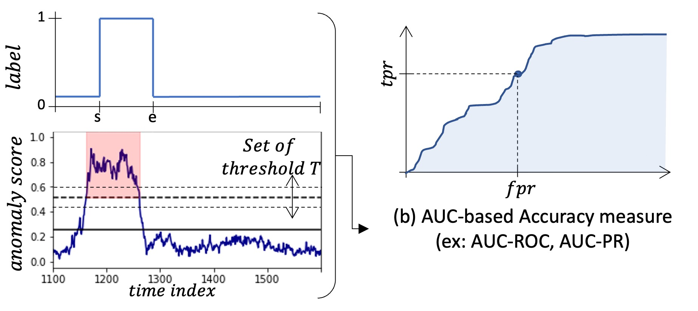

# AUC-based Evaluation

Until now, we introduced accuracy measures requiring to threshold the
produced anomaly score of anomaly detection methods. However, the accuracy values vary
significantly when the threshold changes. In order to evaluate a method
holistically using its corresponding anomaly score, two measures from
the AUC family of measures are used. 

## AUC-ROC

The Area Under the Receiver Operating Characteristics curve (AUC-ROC) is
defined as the area under the curve corresponding to TPR on the y-axis
and FPR on the x-axis when we vary the anomaly score threshold. The area
under the curve is computed using the trapezoidal rule. For that
purpose, we define $Th$ as an ordered set of thresholds between 0 and 1.
Formally, we have $Th=[Th_0,Th_1,...Th_N]$ with
$0=Th_0<Th_1<...<Th_N=1$. Therefore, $AUC\text{-}ROC$ is defined as
follows: 

$AUC\text{-}ROC = \frac{1}{2}\sum_ {k=1}^{N} \Delta^{k}_ {TPR}.\Delta^{k}_ {FPR}$

with:

* ${\Delta^{k}}_ {FPR} = FPR(Th_ {k})-FPR(Th_ {k-1})$

* ${\Delta^{k}}_ {TPR} = TPR(Th_ {k-1})+TPR(Th_ {k})$

## AUC-PR

The Area Under the Precision-Recall curve (AUC-PR) is defined as the area under
the curve corresponding to the Recall on the x-axis and Precision on the
y-axis when we vary the anomaly score threshold. As before, the area
under the curve is computed using the trapezoidal rule. Thus, we define
AUC-PR: 

$AUC\text{-}PR = \frac{1}{2}\sum_ {k=1}^{N} \Delta^{k}_ {Precision}*\Delta^{k}_ {Recall}$

with:

* $\Delta^{k}_ {Recall} = Recall(Th_ {k})-Recall(Th_ {k-1})$

* $\Delta^{k}_ {Precision} = Precision(Th_ {k-1})+Precision(Th_ {k})$

A simpler alternative to approximate the area under
the curve is to compute the average Precision of the PR curve:
In this demo, we use the above equation to approximate AUC-PR.
