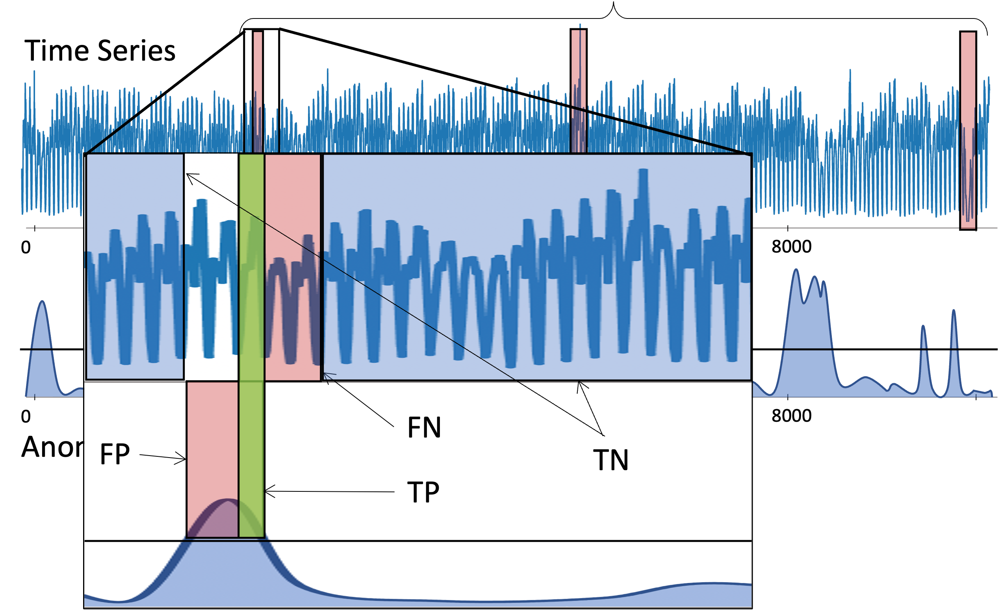

# Threshold-based Evaluation

The anomaly score $S_T$ produced by an AD method $A$ highlights the
parts of the time series $T$ considered as abnormal. The highest values
in the anomaly score correspond to the most abnormal points.
Threshold-based measures require to set a threshold to mark each point
as an anomaly or not. Usually, this threshold is set to
$\mu(S_T) + \alpha.\sigma(S_T)$, with $\alpha$ set to
3, where $\mu(S_T)$ is the mean and $\sigma(S_T)$
is the standard deviation $S_T$. Given a threshold $Thres$, we compute
the $pred \in \{0,1\}^n$ as follows:

$\forall i \in [1,|S_T|],$

$pred_i = 0, \text{if: } S_{T,i} < Thres$

$pred_i = 1, \text{if: } S_{T,i} \geq Thres$

## Generic Threshold-based measures

Threshold-based measures compare $pred$ to $label \in \{0,1\}^n$, which
indicates the true (human provided) labeled anomalies. Given the
Identity vector $I=[1,1,...,1]$, the points detected as anomalies or not
fall into the following four categories:

-   **True Positive (TP)**: Number of points that have been correctly
    identified as anomalies. Formally: $TP = label^\top \cdot pred$.

-   **True Negative (TN)**: Number of points that have been correctly
    identified as normal. Formally:
    $TN = (I-label)^\top \cdot (I-pred)$.

-   **False Positive (FP)**: Number of points that have been wrongly
    identified as anomalies. Formally: $FP = (I-label)^\top \cdot pred$.

-   **False Negative (FN)**: Number of points that have been wrongly
    identified as normal. Formally: $FN = label^\top \cdot (I-pred)$.

Given these four categories, several quality measures have been proposed
to assess the accuracy of AD methods. 

- **Precision:** We define Precision
(or positive predictive value) as the number correctly identified
anomalies over the total number of points detected as anomalies by the
method: $Precision = \frac{TP}{TP+FP}$

- **Recall:** We define Recall (or True Positive Rate
(TPR), $tpr$) as the number of correctly identified anomalies over all
anomalies: $Recall = \frac{TP}{TP+FN}$

- **False Positive Rate (FPR):** A supplemental measure to the Recall is
the FPR, $fpr$, defined as the number of points wrongly identified as
anomalies over the total number of normal points:
$fpr = \frac{FP}{FP+TN}$

- **F-Score:** Precision and Recall evaluate two
different aspects of the AD quality. A measure that combines these two
aspects is the harmonic mean $F_{\beta}$, with non-negative real values
for $\beta$, $F_{\beta} = \frac{ (1+\beta^2).Precision.Recall }{ \beta^2.Precision+Recall }$ 

Usually, $\beta$ is set to 1, balancing the importance
between Precision and Recall. In this demo, $F_1$ is referred to as F
or F-score. 

**Precision@k:** All previous measures require an anomaly
score threshold to be computed. An alternative approach is to measure
the Precision using a subset of anomalies corresponding to the $k$
highest value in the anomaly score $S_T$. This is equivalent to setting
the threshold such that only the $k$ highest values are retrieved.

## Threshold-based Evaluation for time series

To address the shortcomings of the point-based quality measures, a
range-based definition was recently proposed, extending the mathematical
models of the traditional Precision and Recall [Tatbul et al. 2018].
This definition considers several factors: (i) whether a subsequence is
detected or not (ExistenceReward or ER); (ii) how many points in the
subsequence are detected (OverlapReward or OR); (iii) which part of the
subsequence is detected (position-dependent weight function); and (iv)
how many fragmented regions correspond to one real subsequence outlier
(CardinalityFactor or CF). Formally, we define $R=\{R_1,...R_{N_r}\}$ as
the set of anomaly ranges, with
$R_k=\{pos_i,pos_{i+1}, ..., pos_{i+j}\}$ and
$\forall pos \in R_k, label_{pos} = 1$, and $P=\{P_1,...P_{N_p}\}$ as
the set of predicted anomaly ranges, with
$P_k=\{pos_i,pos_{i+1}, ..., pos_{i+j}\}$ and
$\forall pos \in R_k, pred_{pos} = 1$. Then, we define ER, OR, and CF as
follows:

* $ER(R_i,P)$ is defined as follows:

	* $ER(R_i,P) = 1, \text{if } \sum_{j=1}^{N_p} |R_i \cap P_j| \geq 1$

	* $ER(R_i,P) = 0, \text{otherwise}$

* $CF(R_i,P)$ is defined as follows:

	* $CF(R_i,P) = 1, \text{if } \exists P_i \in P, |R_i \cap P_i| \geq 1$

	* $CF(R_i,P) = \gamma(R_i,P), \text{otherwise}$

* $OR(R_i,P)$ is defined as follows:

	* $OR(R_i,P) = CF(R_i,P).\sum_{j=1}^{N_p} \omega(R_i,R_i \cap P_j, \delta)$

The $\gamma(),\omega()$, and $\delta()$ are tunable functions that
capture the cardinality, size, and position of the overlap respectively.
The default parameters are set to $\gamma()=1,\delta()=1$ and $\omega()$
to the overlap ratio covered by the predicted anomaly
range. 

* **Rprecision:** Based on the above, we define:

	* $Rprecision(R,P) = \frac{\sum_{i=1}^{N_p} Rprecision_s(R,P_i)}{N_p}$

	* $Rprecision_s(R,P_i) = CF(P_i,R).\sum_{j=1}^{N_r} \omega(P_i,P_i \cap R_j, \delta)$

* **Rrecall:** Based on the above, we define:

	* $Rrecall(R,P) = \frac{\sum_{i=1}^{N_r} Rrecall_s(R_i,P)}{N_r}$

	* $Rrecall_s(R_i,P) = \alpha.ER(R_i,P) + (1-\alpha).OR(R_i,P)$

 The parameter $\alpha$ is user defined. The default value is $\alpha=0$. 

* **R-F-score (RF):** As described previously, the F-score combines Precision and Recall.
Similarly, we define $RF_{\beta}$, with non-negative real values for
$\beta$ as follows:

	* $RF_{\beta} = \frac{(1+\beta^2).Rprecision.Rrecall}{\beta^2.Rprecision+Rrecall}$

 As before, $\beta$ is set to 1. In this demo, $RF_1$ is referred to as RF-score.

## affiliation-based measures for time series

Another solution to tackle limiataiton associated to time series is to 
introduces a distance-based metric as a solution, called affiliation-based f-score [Huet et al. 2022]. The latter calculate the average of the local precision and recall for each anomaly event. Local precision is calculated by averaging the distance between each predicted anomaly point and its closest labelled anomaly point, and expressing it as the probability of outperforming a random prediction. Recall is calculated
similarly, using the average distance from each labelled anomaly point to its closest predicted anomaly. 

To conlcude, a large taxonomy of evaluation measures both generic and proposed for time series are listed a explained in two recent papers [Paparrizos et al. 2022, Sorbo and Ruocco 2023]

 ## References

* [Tatbul et al. 2018] N. Tatbul, T.J. Lee, S. Zdonik, M. Alam, J. Gottschlich, in Advances in Neural Information Processing Systems, vol. 31

* [Huet et al. 2022] Alexis Huet, Jose Manuel Navarro, and Dario Rossi. 2022. Local Evaluation of Time Series Anomaly Detection Algorithms. In Proceedings of the 28th ACM SIGKDD Conference on Knowledge Discovery and Data Mining (KDD '22).

* [Paparrizos et al. 2022] John Paparrizos, Paul Boniol, Themis Palpanas, Ruey S. Tsay, Aaron Elmore, and Michael J. Franklin. 2022. Volume under the surface: a new accuracy evaluation measure for time-series anomaly detection. Proc. VLDB Endow. 15, 11 (July 2022), 2774–2787.

* [Sorbo and Ruocco 2024] Sørbø, S., Ruocco, M. Navigating the metric maze: a taxonomy of evaluation metrics for anomaly detection in time series. Data Min Knowl Disc 38, 1027–1068 (2024). https://doi.org/10.1007/s10618-023-00988-8