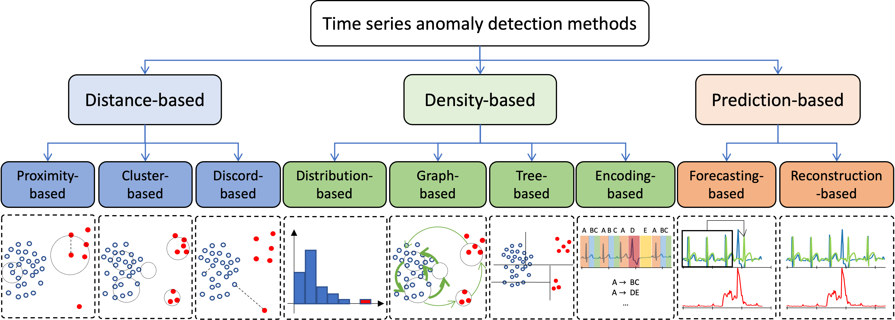
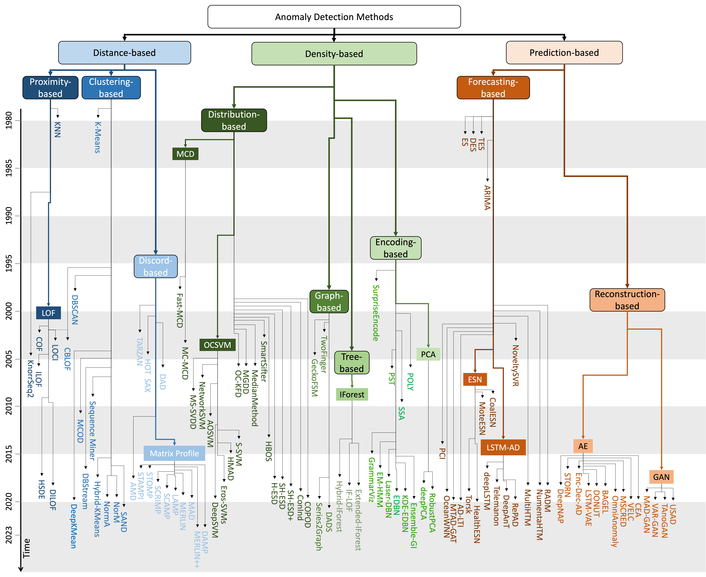

# Anomaly Detection Taxonomy

We divide methods into three categories: (i) distance-based, (ii) density-based, and (iii) prediction-based. The figure below illustrates our proposed process-centric taxonomy. (Note that the second-level categorization is not mutually exclusive; e.g., a  model might encode the time series data while adopting a discord-based identification strategy.)

## Distance-based

This category contains methods that focus on the analysis of subsequences for the purpose of detecting anomalies in time series, mainly by utilizing distances to a given model. This is done purely from the raw time series, using a variety of time series distance measures. Overall, the distance-based algorithms operate on the original time series as is, without the need for further pre-processing. Within this category, we find three sub-categories: **Proximity**-based, **Clustering**-based, and **Discord**-based.

## Density-based 

These methods focus on detecting globally normal or isolated behaviors. They employ time series representations, and measure density in the space that represents the subsequences of the original time series. These representations can be graphs, trees, histograms, grammar induction rules, and others. Within this category, we find four sub-categories: **Distribution**-based, **Graph**-based, **Tree**-based, and **Encoding**-based.

## Prediction-based

This category contains methods train a model to reconstruct the normal data, or predict the future expected normal points. The prediction error is then used to detect abnormal points or subsequences. The underlying assumption of prediction-based methods is that normal data are easier to predict, while anomalies are unexpected, leading to higher prediction errors. Such assumptions are valid when the training set contains no (or almost no) anomalies. Therefore, prediction-based methods are usually more optimal under semi-supervised settings. Within this category, we find two sub-categories: **Forecasting**-based and **Reconstruction**-based.

We provide below a detailed taxonomy of methods proposed in the literature.

